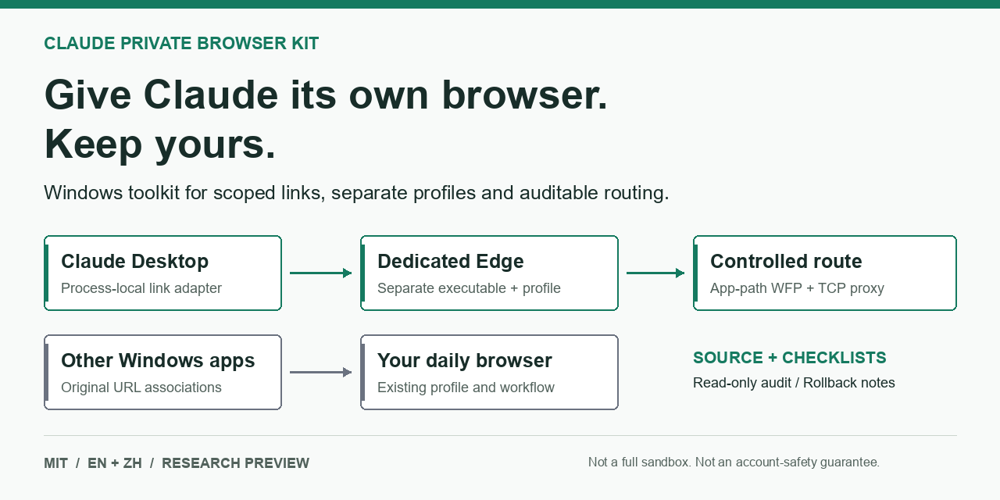

# Claude Account Risk Toolkit

## October 1 Update

The Chinese project name is **Claude 防封方案**. This name describes the concern being investigated, not proven protection against account restrictions. The repository URL stays unchanged.

- [Read-only WFP audit and logged-in safety](docs/OFFLINE-AUDIT.md): verifies full installed filter predicates without launching Claude, changing rules or calling an external checker.
- [Current evidence and research comparison](docs/STATUS-2026-10-01.md): separates observed local results, older tests and unverified workflows.
- Keep account profiles, live manifests, exit addresses and integrity baselines private. The production client and logged-in session are not included.


[Website: Chinese / English](https://jiusi1-cpu.github.io/claude-private-browser-kit/) | [简体中文](README.zh-CN.md) | English

**Concerned about Claude account restrictions? Start with your local environment.**

For users in China and other cross-region setups concerned about account restrictions. Give a local AI agent the repository link to audit mixed browser profiles, unintended direct traffic, DNS / WebRTC exposure and inconsistent desktop/MCP routes, then configure, verify and document rollback.

This is an environment-audit and separation toolkit, not proven anti-ban technology. Whether these conditions affect Claude enforcement, and by how much, is unknown. It does not reverse-engineer or bypass platform detection, or establish service eligibility.



**Windows case tested | MIT | Agent-led setup | Research preview**

**What does "tested on Windows" mean?** The 2026-09-30 local case verified dedicated browser data, external-link routing, configured egress, IPv4 direct-traffic blocking and proxy-failure protection, with bounded UDP / DNS / WebRTC experiments. This is not universal compatibility, measured ban reduction or proof of detection avoidance. See [test results and boundaries](docs/LOCAL-CASE.md).

## Give This Repository to Your AI Agent

Use an agent with local file and terminal access. Paste this request; you do not need to run the setup commands yourself:

```text
Configure a dedicated Claude browser on this Windows computer:
https://github.com/jiusi1-cpu/claude-private-browser-kit

Read AGENTS.md and docs/AGENT-START.en.md first, then inspect this machine.
Within my authorization, adapt to installed versions, back up, implement and verify.
Preserve my default browser, daily browser data, global network settings and timezone.
Do not blindly run historical examples or upload private configuration.
Hand login, elevation and scope changes back to me.
Report passed, failed and unverified checks, with rollback instructions.
If you cannot operate this machine, say so; never claim execution.
```

[Copy from the website](https://jiusi1-cpu.github.io/claude-private-browser-kit/) | [Agent runbook](docs/AGENT-START.en.md) | [中文实施手册](docs/AGENT-START.zh-CN.md)

You control authorization and login; the agent handles inspection, adaptation and verification. A chat-only AI cannot configure your machine. Agent-led setup is not a universal installer or proof of compatibility.

## Why This Exists

Claude opens a link. Your everyday browser appears, with your everyday profile. Changing the Windows default browser would affect every other app too.

This project documents a narrower approach: an application-local link adapter, a dedicated Edge copy and profile, and app-path network restrictions. It includes original source, a read-only auditor, reproducible checklists, and rollback references.

- **Scoped routing:** Claude's external web links go to its dedicated browser in the tested case.
- **Separate browser data:** a dedicated executable and profile, with independent update maintenance.
- **Evidence, not a green badge:** static checks distinguish PASS, FAIL, and UNVERIFIED; live network tests remain explicit.

**This is a source and documentation package, not a universal installer.** Start with the safe checks below before adapting the implementation.

An auditable case study and toolkit for giving Claude Desktop a dedicated browser executable, separate browser data, a controlled proxy route, and a narrowly scoped external-link adapter without replacing the Windows default browser.

This is not a fingerprint-spoofing product, an account-ban prevention guarantee, or a way to establish service eligibility. It does not hide an entire operating system from an agent with arbitrary code execution. Use only accounts, networks, and services you are authorized to access.

## Start Here

- [English sharing copy and tested scope](docs/SHARE.en.md)

- [Complete design and implementation logic](docs/GUIDE.en.md)
- [Bilingual audit checklist](docs/CHECKLIST.md)
- [X research, contradictory reports, and evidence limits](docs/RESEARCH-X.md)
- [Sanitized local test results and unverified areas](docs/LOCAL-CASE.md)
- [Security boundaries](SECURITY.md)
- [What is packaged and what is deliberately excluded](docs/PACKAGE-MAP.md)
- [Pre-publication checklist](docs/RELEASE.md)
- [Concise documentation index for agents](llms.txt)
- [Contributing and reproducible reports](CONTRIBUTING.md)

## Architecture

```text
Claude Desktop external HTTP(S) link
  -> process-local shell.openExternal adapter
  -> dedicated Edge executable + dedicated profile
  -> app-path WFP restrictions
  -> loopback TCP proxy -> authorized upstream proxy -> Internet

Claude browser MCP -> private Node, stdio -> same dedicated Edge/profile
Other Windows applications -> original Windows URL associations -> daily browser
```

There is no global URL router in the deployed case. Browser Tamer was considered and rejected because a global default-handler architecture would also receive links from unrelated applications.

## Read-only Checks for the Agent

### Optional Third-party Browser Check

[Open the Net.Coffee Claude AI IP checker](https://ip.net.coffee/claude/)

Use this as a supplementary view of the current browser's egress IP, DNS, WebRTC and device information. Ask the agent to open it in the dedicated browser and compare before/after observations. A normal link click does not switch browsers; a daily-browser result does not establish the private browser or all Claude process routes.

This is not an official Claude test. Its score is not Claude's internal risk decision or proof against bans. Visiting exposes your egress IP and readable browser information to the third-party site and its test services. We only link to it, with no embedded or automatic test. Do not submit passwords/tokens or publish screenshots containing IPs. Continue with [controlled live checks](docs/CHECKLIST.md).

### Local Static Checks

Requires Node.js 22 or newer. These commands use only built-in Node modules; no `npm install` is required.

```powershell
npm test
npm run check:release
node scripts/audit.cjs --config examples/audit.example.json
```

The last command intentionally returns **UNVERIFIED, exit 2**, because example paths are not a configured environment. Create a local `audit.local.json` with your actual paths, then pass that file. It is gitignored. Do not publish it.

The auditor is read-only and makes no network requests. It can compare paths and hashes, inspect the package hook, and flag missing resources. It cannot establish real traffic behavior, successful login, or account safety. Read [the checklist](docs/CHECKLIST.md) before interpreting any PASS.

## Code Layout

| Path | Purpose |
| --- | --- |
| `src/private-links.cjs` | Original process-local external-link adapter, with no system default changes |
| `src/ClaudeGuardWfp.cs` | Original Windows Filtering Platform helper, x64/admin required for rule changes |
| `src/NetworkProbe.cs` | Controlled TCP/UDP probe source, not a prebuilt executable |
| `src/guarded-mcp.cjs` | Original stdio tool allowlist around a separately installed Playwright MCP |
| `scripts/audit.cjs` | Read-only static environment audit |
| `scripts/release-check.cjs` | Source-package hygiene and local Markdown-link checks |
| `reference/*.example` | Redacted implementation scripts requiring manual adaptation, not executable entry points |
| `examples/` | Non-working placeholder configurations, without credentials |
| `evidence/` | Minimal historical test summaries, without private paths or exit IP |

## What Was Actually Tested

The original local case used Claude Desktop `2.9939.2`, Edge `154.0.4258.37`, and Playwright MCP `0.0.83`. It exercised direct-route blocking, proxy outage recovery, UDP delivery with a positive control, DNS observations with a positive control, browser/MCP egress, external-link routing, and an actual patch rollback. The public export is not a fresh-machine deployment test. Login and authenticated Claude model-driven MCP workflows remain unverified in the retained evidence.

## Important Tradeoffs

- Patching application files invalidates vendor trust assumptions. The case already had an invalid executable signature before this adapter. Updating ASAR digests does not restore Authenticode.
- The patch retained Electron security fuse bytes; it did not disable package-integrity checks.
- The private browser is a real separate copy and needs its own update maintenance. Do not freeze an old browser indefinitely.
- A separate profile under the same Windows user is not a VM or a full filesystem isolation boundary.
- Manual browser use and MCP share a profile. Close the manual instance before starting an MCP-managed instance.
- WFP `Verify` is a presence/basic-metadata check, not a complete predicate or live network proof.
- No time-zone changes, global proxy changes, account actions, or GitHub publication are performed by the safe commands above.

## License and Status

[MIT](LICENSE) for original material only; see [third-party boundaries](THIRD_PARTY_NOTICES.md). Unofficial and not affiliated with Anthropic or Microsoft. The npm `private` flag prevents accidental npm publication; it does not prevent hosting source on GitHub.

## FAQ

**Does this change the Windows default browser?** No global URL router was deployed in the documented case. The adapter is scoped to Claude's process.

**Is a separate Edge profile a security sandbox?** No. It separates browser data, not arbitrary filesystem access by code running as the same Windows user.

**Does it guarantee a fixed IP or prevent account bans?** No. Exit stability depends on your authorized upstream service and must be measured. No account-safety or region-eligibility guarantee is made.

**Where should an AI agent start?** Read [AGENTS.md](AGENTS.md) and the [runbook](docs/AGENT-START.en.md). [llms.txt](llms.txt) indexes supporting material. These are execution and navigation aids, not a claim of crawler indexing or AI recommendation.
