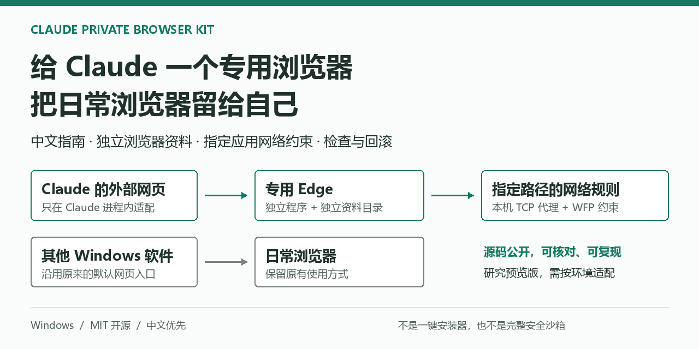

# Claude 专用浏览器工具包

**担心 Claude 账号风控？先把本机网络与浏览器环境理清。**

[项目网站：自动选择中英文](https://jiusi1-cpu.github.io/claude-private-browser-kit/) · [English](README.en.md) · [完整中文指南](docs/GUIDE.zh-CN.md) · [检查清单](docs/CHECKLIST.md) · [反馈问题](https://github.com/jiusi1-cpu/claude-private-browser-kit/issues)

Claude Private Browser Kit 面向中国用户及其他跨区域使用场景中关注账号限制的人群。它把可检查的本机问题拆开处理：浏览器资料混用、意外直连、DNS / WebRTC 暴露，以及桌面端和 MCP 入口不一致。让本地 AI Agent 执行环境自检、隔离配置、验收与回滚，而不是让用户自己研究脚本。

**定位是环境自检与隔离，不是已经证实的“防封”技术。** 这些现象是否影响 Claude 风控、影响多大，现有证据无法确定；本项目不逆向或绕过平台检测，不改变服务使用资格。



**Windows 本机案例已验证 · MIT 开源 · Agent 执行 · 研究预览版**

**Windows 实测有效，具体指什么？** 2026-09-30 的本机案例验证了专用浏览器资料分离、外部链接分流、指定出口、IPv4 直连阻断及代理故障保护，并记录了 UDP / DNS / WebRTC 的限定实验。不是所有机器通用兼容，更不是降低封号率或规避检测的实验证明。查看 [实测项目与边界](docs/LOCAL-CASE.md)。

> 当前交付是源码、参考脚本和验证文档，不是下载后双击就能完成配置的一键安装器。可以先运行只读检查，不必先修改系统。

## 直接交给 AI Agent

不需要先学会配置脚本。把这个仓库链接交给**能操作你本机文件和终端的 AI Agent**，并告诉它“帮我配置”。推荐复制下面这段，执行范围更清楚：

```text
请帮我在这台 Windows 电脑上配置 Claude 专用浏览器：
https://github.com/jiusi1-cpu/claude-private-browser-kit

先读 AGENTS.md 和 docs/AGENT-START.zh-CN.md，再检查本机环境。
在我授权的范围内，完成版本适配、备份、实施、实际验收和回滚说明。
不要修改系统默认浏览器、日常浏览器资料、全局网络或时区。
不要盲跑历史示例，不要上传私人配置。
需要登录、提权或扩大改动范围时由我接手。
最后区分已通过、失败和未验证；不能操作本机时先说明，不要假装执行。
```

[网站一键复制指令](https://jiusi1-cpu.github.io/claude-private-browser-kit/) · [Agent 中文实施手册](docs/AGENT-START.zh-CN.md) · [Agent English runbook](docs/AGENT-START.en.md)

你负责授权和登录，Agent 负责调查、适配与验证。普通网页聊天 AI 如果没有本机工具，只能解释方案，不能替你完成配置。**AI 接手不等于通用一键安装，也不等于已验证兼容你的机器。**

## 你可能也遇到过

- Claude 打开网页，跳进的却是你平时使用的 Edge。
- 已经配置了浏览器 MCP，点击桌面端的登录按钮还是打开另一个浏览器。
- 只想让 Claude 和专用浏览器使用指定代理，不想改全局默认浏览器。
- 代理能用，却不清楚断开之后会不会直连，DNS、UDP 又该怎么检查。
- 跟着教程改过一些配置，后来不知道改了哪里，也不知道怎么恢复。

本项目把这些问题拆成独立入口处理，并给出已实施案例、源码与验收方法。**MCP 浏览器配置和桌面端外部链接适配不是同一件事**，这是本项目重点解决的差别。

## 做了什么，没做什么

| 你的需求 | 本项目提供 | 需要知道的边界 |
| --- | --- | --- |
| Claude 打开的网页进入专用浏览器 | Claude 进程内的外部链接适配器 | 涉及应用补丁，与具体版本耦合 |
| 不混用日常浏览器资料 | 独立 Edge 程序和资料目录的实施方法 | 同一 Windows 用户下不等于完整安全沙箱 |
| 只约束指定应用的网络路径 | Windows Filtering Platform（WFP）源码与代理配置参考 | 规则按程序路径生效，不自动覆盖所有子进程或升级后的新路径 |
| 检查代理中断、UDP、DNS 等行为 | 检查清单、控制实验与历史脱敏证据 | 静态检查通过不能替代真实流量测试 |
| 改动可以核对、可以恢复 | 文件哈希检查、补丁快照与回滚参考 | 不能直接把别人的备份用于自己的机器 |

**不提供账号、代理节点或所谓“干净 IP”；不承诺防封号，也不宣称隐藏所有地区信号。** 这里只讨论你有权使用的账号、网络与服务。项目不会修改系统时区。

## 给 Agent 的只读检查入口

以下是 Agent 使用的技术入口，用户无需逐条手动操作。Agent 必须先阅读实施手册，并按本机情况适配；仍需维护浏览器副本和应用补丁，不是未经验证的自动安装承诺。

先克隆仓库，需要本机已有 Git 和 Node.js 22 或更新版本：

```powershell
git clone https://github.com/jiusi1-cpu/claude-private-browser-kit.git
cd claude-private-browser-kit
npm test
npm run check:release
node scripts/audit.cjs --config examples/audit.example.json
```

这些检查只用 Node 标准库，**无须 npm install**，不会安装网络规则、改注册表或修改 Claude。

最后一条使用示例路径，预期是 **UNVERIFIED（尚未验证），退出码 2**。这不是部署成功，也不是让你忽略错误。检查自己的环境时，按 [完整指南](docs/GUIDE.zh-CN.md) 建立本地 `audit.local.json`，不要把真实路径和配置上传到仓库。

| 结果 | 含义 |
| --- | --- |
| PASS | 本项静态条件通过，不代表全部网络行为通过 |
| FAIL | 检查发现明确不符合条件的项，需要处理 |
| UNVERIFIED | 缺少配置或实际测试证据，不能宣布通过 |

**建议顺序：读边界 → 运行只读检查 → 备份与适配 → 做真实网络验收 → 验证回滚。** 参考脚本保留 `.example` 后缀，不应改名后直接盲跑。

## 为什么不直接换系统默认浏览器？

因为那会改变其他软件打开网页的入口。本案例选择只在 Claude 进程内适配外部网页：

```text
Claude Desktop 的外部网页
    → 进程内链接适配器
    → 专用 Edge 程序 + 专用资料目录
    → 按程序路径限制网络
    → 本机 TCP 代理 → 已授权的上游代理

Claude 浏览器 MCP
    → 独立 Node / 标准输入输出管道
    → 同一专用 Edge 环境

其他 Windows 软件
    → 原有系统默认入口
    → 你的日常浏览器
```

这里的“专用”有明确范围：浏览器状态和指定路径的网络规则。具备本机代码执行权限的智能体仍可能访问文件、启动其他程序；不能把此方案当作虚拟机或完整沙箱。

## 按你的问题找文档

| 想了解什么 | 从这里开始 |
| --- | --- |
| 完整原理、方案取舍与实施顺序 | [中文指南](docs/GUIDE.zh-CN.md) |
| IP、TCP/UDP、WebRTC、DNS 怎么验收 | [中英双语检查清单](docs/CHECKLIST.md) |
| 本机到底测过什么、没测什么 | [脱敏案例记录](docs/LOCAL-CASE.md) |
| 社区传言哪些有依据 | [X 研究与证据边界](docs/RESEARCH-X.md) |
| 哪些源码公开，哪些东西没有打包 | [打包清单](docs/PACKAGE-MAP.md) |
| 如何描述问题而不泄露自己的配置 | [贡献指南](CONTRIBUTING.md) |
| 想转发给同样有需求的人 | [中文介绍与转发文案](docs/SHARE.zh-CN.md) |
| 让 AI 快速定位资料 | [精简文档索引](llms.txt) |

## 源码入口

- `src/private-links.cjs`：桌面端外部网页打开适配，不替换系统默认浏览器。
- `src/ClaudeGuardWfp.cs`：WFP 网络限制辅助源码，修改规则需要 x64 管理员进程。
- `src/NetworkProbe.cs`：TCP/UDP 控制实验探针源码。
- `src/guarded-mcp.cjs`：围绕独立安装的 Playwright MCP 的工具白名单；不是完整安全边界。
- `scripts/audit.cjs`：不联网的只读静态检查器。
- `reference/*.example`：需由 Agent 审查并按本机适配的脱敏历史实施脚本，不是可直接执行的安装器。
- `examples/`、`evidence/`：无真实节点的示例与最小化历史证据。

## 验证到哪一步了？

原本机案例使用 Claude Desktop `2.9939.2`、Edge `154.0.4258.37`、Playwright MCP `0.0.83`，执行过直连阻断、代理中断恢复、UDP/DNS 阳性对照、浏览器与 MCP 出口检查、外部链接路由和实际回滚。版本仅用于复现记录，不代表推荐长期停留在这些版本。

**仍未证明：**全新电脑完整部署、登录后的真实 Claude 模型驱动 MCP 全链路，以及长期出口稳定性。Cowork、Claude Code 和任意子进程不会因配置了专用浏览器就自动全部受控，需要分别验收。

应用补丁会影响厂商签名信任状态；更新应用包摘要不会恢复 Authenticode。独立 Edge 副本需要安全更新。WFP `Verify` 只核对规则存在与部分元数据，不能替代规则条件审计和实际网络实验。详见 [安全边界](SECURITY.md)。

## 常见问题

**只新建一个 Edge 配置文件够不够？**  
它可以分离部分浏览器资料，但未解决桌面端外部链接入口，也不能让按可执行路径施加的网络规则区分同一程序的不同资料目录。

**能保证固定 IP、家宽或不封号吗？**  
不能。上游出口性质和稳定性需要你自行核验，本项目不出售或推荐代理，也不把一次检测结果当成长期保证。

**需要同时运行手动浏览器和 MCP 吗？**  
本案例两者共用专用资料目录。开始 MCP 任务前应关闭手动实例，避免资料目录占用冲突。

**后续升级 Claude 或 Edge 怎么办？**  
重新核对路径、补丁与规则，然后复测。不要把一次成功当成所有未来版本都兼容。

## 一起把它做得更可复现

最有价值的反馈是：哪个 Windows/Claude/Edge 版本、复现步骤、预期和实际行为，以及脱敏后的检查结果。欢迎 [提交 Issue](https://github.com/jiusi1-cpu/claude-private-browser-kit/issues) 或参与改进；不要上传令牌、代理凭据、真实出口 IP、浏览器资料和原始日志。

觉得有用可以 Star 留作参考，也欢迎把 [中文介绍](docs/SHARE.zh-CN.md) 转给遇到同样问题的人。我们更需要可复现的反馈，而不是没有依据的“有效”“防封”结论。

原创代码和文档采用 [MIT](LICENSE)，第三方边界见 [说明](THIRD_PARTY_NOTICES.md)。**非官方项目，与 Anthropic、Microsoft 无隶属关系。**
